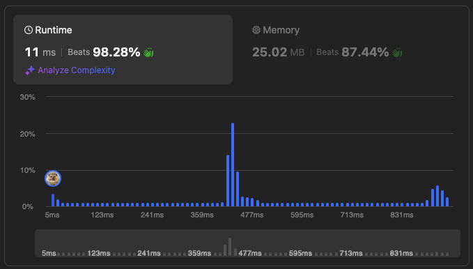
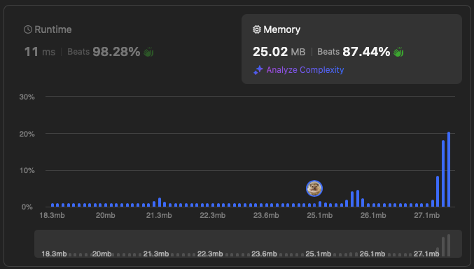

# [217. Contains Duplicate](https://leetcode.com/problems/contains-duplicate/description/)


## Problem Description

Given an integer array nums, return `true` if any value appears more than once in the array, otherwise return `false`.

### Example 1:
```plaintext
Input: nums = [1, 2, 3, 3]
Output: true
```

### Example 2:
```plaintext
Input: nums = [1, 2, 3, 4]
Output: false
```


### Constraints:
- `0 <= nums.length <= 200`
- `-10^9 <= nums[i] <= 10^9`

## Solution

```python
# solution.py

# solution 1
def containsDuplicate1(self, nums):        
    nums_s = set(nums)
    return len(nums) != len(nums_s)
```

```python
# solution.py

# solution 2
def containsDuplicate2(self, nums):   
    seen = dict()

    for n in nums:
        if n in seen:
            return True
        else:
            seen[n] = 0
        
    return False
```

## Explanation
Complexity

Time: O(n)

Space: O(n)

Solution 1 is very intuitive. When casting a list to a set, the duplicates are not being added to the set.
Therefore if the length of the set and original list are the same, then the list did not have a duplicate.
Else, it has duplicates. This operation takes O(n) time due to casting list to set and O(n) space due to the set.

Complexity

Time: O(n)

Space: O(n)

Solution 2 is intuitive as well. We want to keep on recording the seen numbers, so when we see a number that was seen (duplicate) we can return True. Otherwise, False. Dictionary is chosen because of its O(1) time for `in` operation.
This operation takes O(n) time due to looping over all elements in the list and O(n) space due to the dictionary.

## Results

The following graphs show the performance of the solution:

### Time Complexity


### Memory Usage
