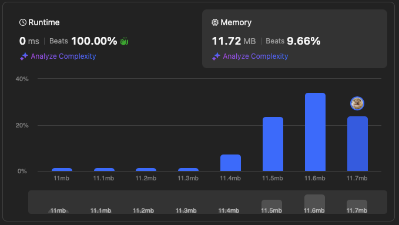
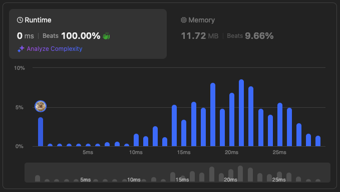

Here’s a markdown file (`README.md`) that you can use on GitHub. It includes a description of the problem, your solution, and the images showing the results:

```markdown
# Merge Sorted Arrays

## Problem Description

You are given two integer arrays `nums1` and `nums2`, sorted in non-decreasing order, and two integers `m` and `n`, representing the number of elements in `nums1` and `nums2` respectively.

The task is to merge `nums1` and `nums2` into a single array sorted in non-decreasing order. The final sorted array should not be returned by the function but instead be stored inside `nums1`. To accommodate this, `nums1` has a length of `m + n`, where the first `m` elements denote the elements that should be merged, and the last `n` elements are set to `0` and should be ignored. `nums2` has a length of `n`.

### Example 1:
```plaintext
Input: nums1 = [1, 2, 3, 0, 0, 0], m = 3, nums2 = [2, 5, 6], n = 3
Output: [1, 2, 2, 3, 5, 6]
```

### Example 2:
```plaintext
Input: nums1 = [1], m = 1, nums2 = [], n = 0
Output: [1]
```

### Example 3:
```plaintext
Input: nums1 = [0], m = 0, nums2 = [1], n = 1
Output: [1]
```

### Constraints:
- `nums1.length == m + n`
- `nums2.length == n`
- `0 <= m, n <= 200`
- `1 <= m + n <= 200`
- `-10^9 <= nums1[i], nums2[j] <= 10^9`

## Solution

Here’s the Python solution:

```python
# solution.py

def merge(nums1, m, nums2, n):
    # Last index of nums1
    last = m + n - 1

    # Merge in reverse order
    while m > 0 and n > 0:
        if nums1[m - 1] > nums2[n - 1]:
            nums1[last] = nums1[m - 1]
            m -= 1
        else:
            nums1[last] = nums2[n - 1]
            n -= 1
        last -= 1

    # Fill nums1 with leftover elements from nums2
    while n > 0:
        nums1[last] = nums2[n - 1]
        n -= 1
        last -= 1
```

## Results

The following graphs show the performance of the solution:

### Memory Usage


### Time Complexity

```

This markdown file:
1. Describes the problem, using the content from `question.md` file.
2. Includes a Python code snippet from `solution.py`.
3. Displays the two images at the bottom of the file.

Make sure you place the images (`space.png` and `time.png`) in the same directory as the markdown file when pushing to GitHub so they display correctly.