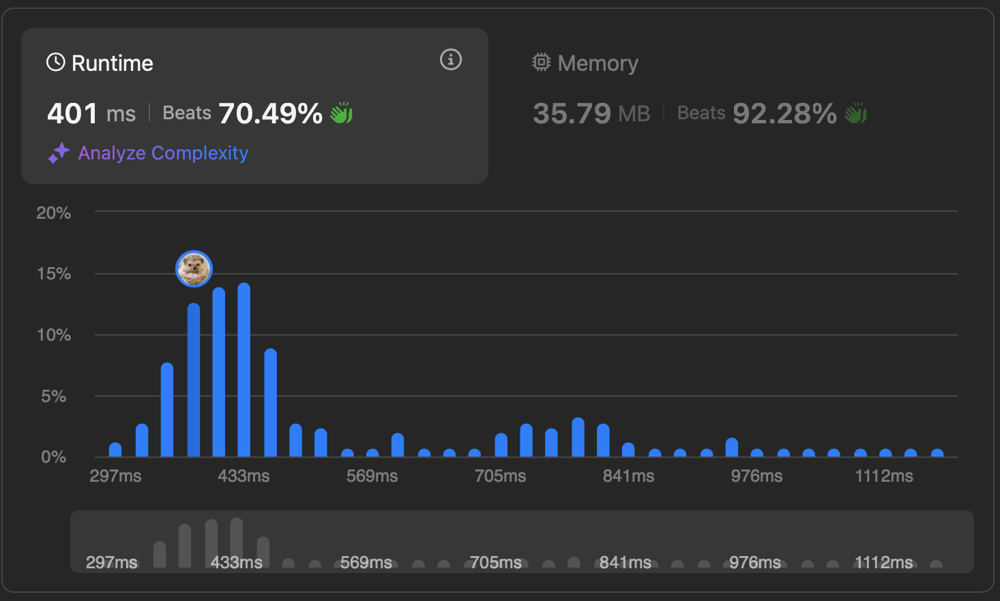

# [295. Find Median from Data Stream](https://leetcode.com/problems/find-median-from-data-stream/description/)


## Problem Description

The median is the middle value in an ordered integer list. If the size of the list is even, there is no middle value, and the median is the mean of the two middle values.

- For example, for `arr = [2,3,4]`, the median is `3`.
- For example, for `arr = [2,3]`, the median is `(2 + 3) / 2 = 2.5`.
- Implement the `MedianFinder` class:

- `MedianFinder()` initializes the `MedianFinder` object.
- `void addNum(int num)` adds the integer `num` from the data stream to the data structure.
- `double findMedian()` returns the median of all elements so far. Answers within `10^-5` of the actual answer will be accepted.


### Example:
```plaintext
Input
["MedianFinder", "addNum", "addNum", "findMedian", "addNum", "findMedian"]
[[], [1], [2], [], [3], []]
Output
[null, null, null, 1.5, null, 2.0]

Explanation
MedianFinder medianFinder = new MedianFinder();
medianFinder.addNum(1);    // arr = [1]
medianFinder.addNum(2);    // arr = [1, 2]
medianFinder.findMedian(); // return 1.5 (i.e., (1 + 2) / 2)
medianFinder.addNum(3);    // arr[1, 2, 3]
medianFinder.findMedian(); // return 2.0
```


### Constraints:
- `-10^5 <= num <= 10^5`
- There will be at least one element in the data structure before calling `findMedian`.
- At most 5 * 10^4 calls will be made to `addNum` and `findMedian`.

Follow up:

- If all integer numbers from the stream are in the range `[0, 100]`, how would you optimize your solution?
- If 99% of all integer numbers from the stream are in the `range [0, 100]`, how would you optimize your solution?


## Solution

```python
# solution.py

class MedianFinder(object):

    def __init__(self):
        self.small, self.big = [], []

    def addNum(self, num):
        """
        :type num: int
        :rtype: None
        """
        heapq.heappush(self.small, -num)

        if self.small and self.big and -self.small[0] > self.big[0]:
            val = -heapq.heappop(self.small)
            heapq.heappush(self.big, val)
            
        if len(self.small) > len(self.big) + 1:
            val = -heapq.heappop(self.small)
            heapq.heappush(self.big, val)

        if len(self.small) + 1 < len(self.big):
            val = -heapq.heappop(self.big)
            heapq.heappush(self.small, val)

    def findMedian(self):
        """
        :rtype: float
        """
        if (len(self.small)+len(self.big)) % 2 == 0:
            return float((-self.small[0] + self.big[0])) / 2
        else:
            if len(self.small) > len(self.big):
                return -self.small[0]
            else:
                return self.big[0]
```

## Explanation
Complexity

Time: 
- `addNum`: O(logn)
- `findMedian`: O(1)

Space: O(n)

We make MaxHeap and MinHeap to keep track on the middle numbers. We use MaxHeap for smaller half and MinHeap for bigger half, since the maximum of smaller half is smaller or equal to the minimum of bigger half, which makes O(1) for findMedian. We add values to smaller half by default. Then we perform balancing the size and compare the max of smaller half and minimum of bigger half to keep the constraint.

## Results

The following graphs show the performance of the solution:

### Time Complexity


### Memory Usage
