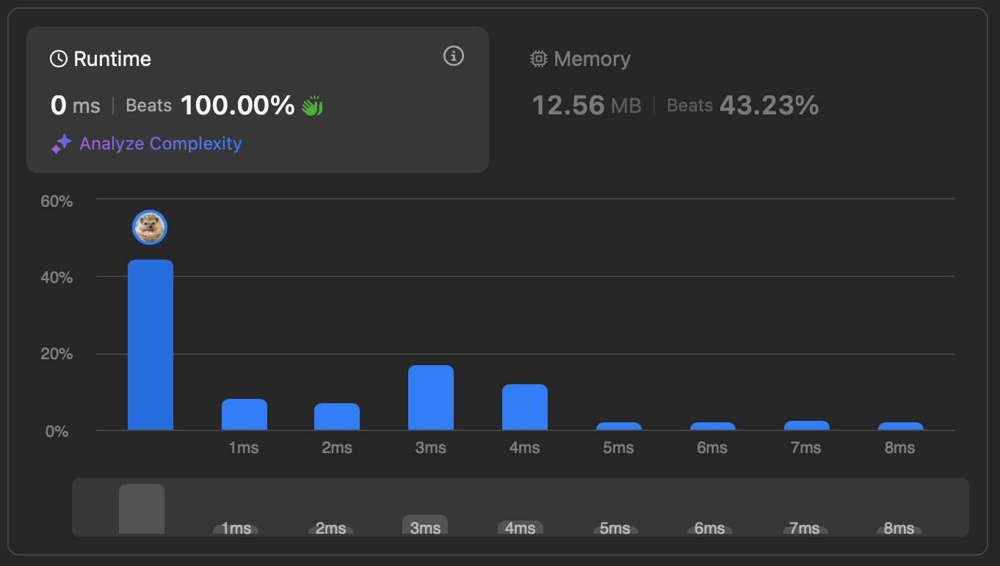
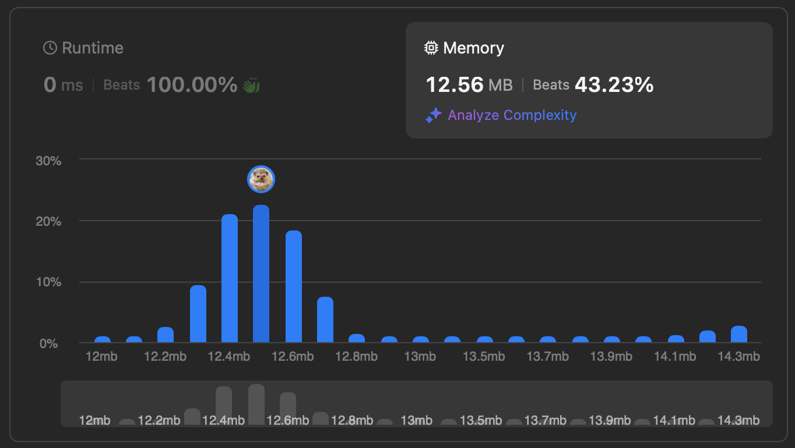
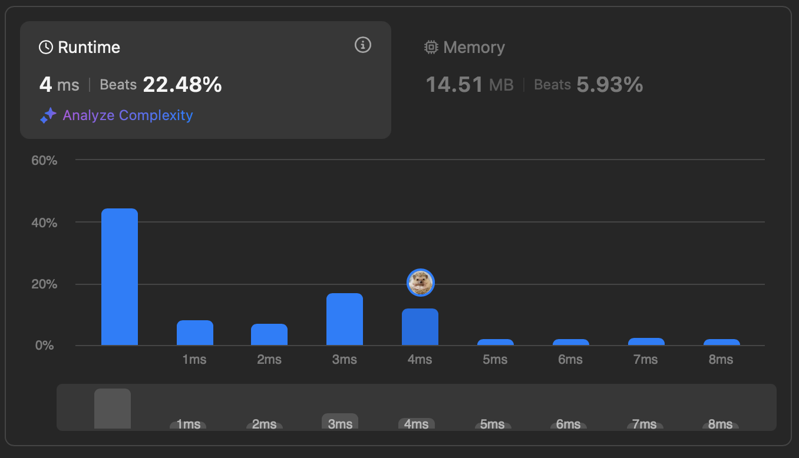
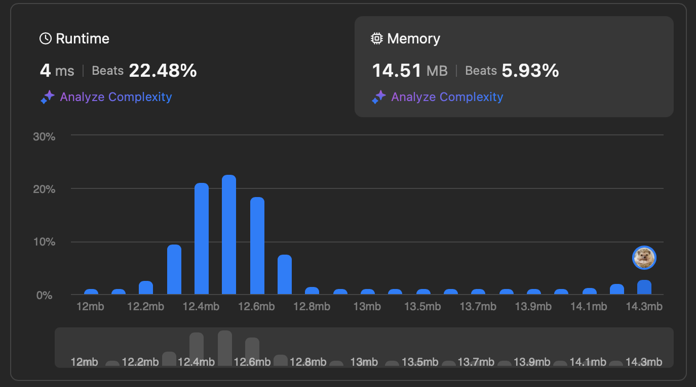

# [102. Binary Tree Level Order Traversal](https://leetcode.com/problems/binary-tree-level-order-traversal/description/)


## Problem Description

Given the `root` of a binary tree, return the level order traversal of its nodes' values. (i.e., from left to right, level by level).


### Example 1:
```plaintext
Input: root = [3,9,20,null,null,15,7]
Output: [[3],[9,20],[15,7]]
```

### Example 2:
```plaintext
Input: root = [1]
Output: [[1]]
```

### Example 3:
```plaintext
Input: root = []
Output: []
```

### Constraints:
- The number of nodes in the tree is in the range `[0, 2000]`.
- `-1000 <= Node.val <= 1000`

Follow up: Could you do this in one pass?

## Solution

```python
# solution.py

def levelOrder(self, root): # solution 1 BFS
    queue = collections.deque([root])
    result = []
    
    while queue:
        level = []
        for i in range(len(queue)):
            node = queue.popleft()
            if node:
                level.append(node.val)
                queue.append(node.left)
                queue.append(node.right)
            
        if level:
            result.append(level)

    return result
```

```python
# solution.py

def levelOrder2(self, root): # solution 2 DFS
    """
    :type root: Optional[TreeNode]
    :rtype: List[List[int]]
    """

    result = []

    def dfs(node, depth):
        if not node:
            return None

        if len(result) == depth:
            result.append([])

        result[depth].append(node.val)
        dfs(node.left, depth+1)
        dfs(node.right, depth+1)
        
    dfs(root, 0)
    return result
```

## Explanation
Complexity

Time: O(n)

Space: O(n)

We use queue to keep track on the nodes in the same level. The length of the queue is the number of nodes in the current level. 

Complexity

Time: O(n)

Space: O(n)

We recursively calculate the depth of left and right subtree of each node to keep track on the index in `result`. We perform depth-first search and append nodes to `result_i`, where `i=level`.

## Results

The following graphs show the performance of the solution:

### Time Complexity


### Memory Usage


### Time Complexity


### Memory Usage
