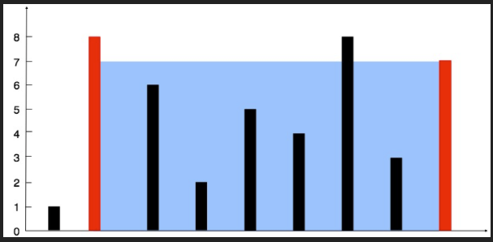

# [11. Container With Most Water](https://leetcode.com/problems/container-with-most-water/description/)


## Problem Description

You are given an integer array height of length `n`. There are `n` vertical lines drawn such that the two endpoints of the `i-th` line are `(i, 0)` and `(i, height[i])`.

Find two lines that together with the x-axis form a container, such that the container contains the most water.

Return the maximum amount of water a container can store.

Notice that you may not slant the container.



### Example 1:
```plaintext
Input: height = [1,8,6,2,5,4,8,3,7]
Output: 49
```

### Example 2:
```plaintext
Input: height = [1,1]
Output: 1
```

### Constraints:
- `n == height.length`
- `2 <= n <= 10^5`
- `0 <= height[i] <= 10^4`

## Solution

```python
# solution.py

def maxArea(self, height):
    """
    :type height: List[int]
    :rtype: int
    """
    l, r = 0, len(height) - 1
    max_a = 0
    
    while l < r:
        h = min(height[l], height[r])
        w = r - l
        max_a = max(h*w, max_a)

        if height[l] > height[r]:
            r -= 1
        else:
            l += 1
    
    return max_a
```

## Explanation
Complexity

Time: O(n)

Space: O(1)

We use two pointers that are adjusted everytime. We calculate the area in every iteration to make sure the current area is the largest. 

## Results

The following graphs show the performance of the solution:

### Time Complexity


### Memory Usage
