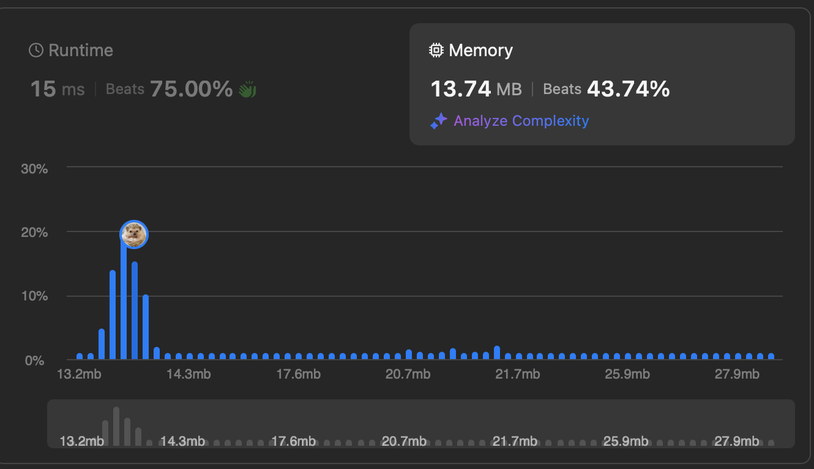

# [1268. Search Suggestion System](https://leetcode.com/problems/search-suggestion-system/description/)


## Problem Description

You are given an array of strings products and a string `searchWord`.

Design a system that suggests at most three product names from products after each character of `searchWord` is typed. Suggested products should have common prefix with `searchWord`. If there are more than three products with a common prefix return the three lexicographically minimums products.

Return a list of lists of the suggested products after each character of `searchWord` is typed.

### Example 1:
```plaintext
Input: products = ["mobile","mouse","moneypot","monitor","mousepad"], searchWord = "mouse"
Output: [["mobile","moneypot","monitor"],["mobile","moneypot","monitor"],["mouse","mousepad"],["mouse","mousepad"],["mouse","mousepad"]]
```

### Example 2:
```plaintext
Input: products = ["havana"], searchWord = "havana"
Output: [["havana"],["havana"],["havana"],["havana"],["havana"],["havana"]]
```

### Constraints:
- `1 <= products.length <= 1000`
- `1 <= products[i].length <= 3000`
- `1 <= sum(products[i].length) <= 2 * 10^4`
- All the strings of `products` are unique.
- `products[i]` consists of lowercase English letters.
- `1 <= searchWord.length <= 1000`
- `searchWord` consists of lowercase English letters.


## Solution

```python
# solution.py

def suggestedProducts(self, products, searchWord):
    """
    :type products: List[str]
    :type searchWord: str
    :rtype: List[List[str]]
    """
    
    products.sort()
    res, prefix = [], ''
    for c in searchWord:
        prefix = ''.join([prefix, c]))
        i = bisect.bisect_left(products, prefix)
        res.append([w for w in products[i:i + 3] if w.startswith(prefix)])
    return res
```

## Explanation
Complexity

Time: O(nlogn)

Space: O(n)

We first sort the array of words. Then we keep track of the prefix of the `searchWord` by concatenating characters of the prefix. Then we perform binary search and find the index of the beggining of the array of words with the prefix. Then select top 3 of them if the word starts the prefix.


## Results

The following graphs show the performance of the solution:

### Time Complexity


### Memory Usage
