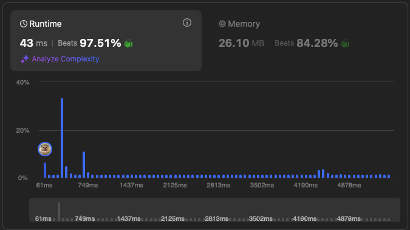

# [128. Longest Consecutive Sequence](https://leetcode.com/problems/longest-consecutive-sequence/description/)


## Problem Description

Given an unsorted array of integers nums, return the length of the longest consecutive elements sequence.

You must write an algorithm that runs in `O(n)` time.


### Example 1:
```plaintext
Input: nums = [100,4,200,1,3,2]
Output: 4
```

### Example 2:
```plaintext
Input: nums = [0,3,7,2,5,8,4,6,0,1]
Output: 9
```


### Constraints:
- `0 <= nums.length <= 10^5`
- `-10^9 <= nums[i] <= 10^9`

## Solution

```python
# solution.py

def longestConsecutive(self, nums):
    """
    :type nums: List[int]
    :rtype: int
    """
    numset = set(nums)
    max_l = 0

    for i, n in enumerate(numset):
        if n-1 not in numset:
            length = 1
            while n + length in numset:
                length += 1

            max_l = max(length, max_l)
        
    return max_l
```

## Explanation
Complexity

Time: O(n)

Space: O(n)

We first make a set using `nums` to have a `O(1)` lookup time and get rid of duplicates. Then we go over each element to check if the number before it exists in the set. If not, that's the start of the sequence, so we loop through the set and increment the length until we don't have `n+length` in the set. Then, update the maximum length by taking the maximum between `length` and `max_l`. We repeat this and return the maximum length.


## Results

The following graphs show the performance of the solution:

### Time Complexity


### Memory Usage
