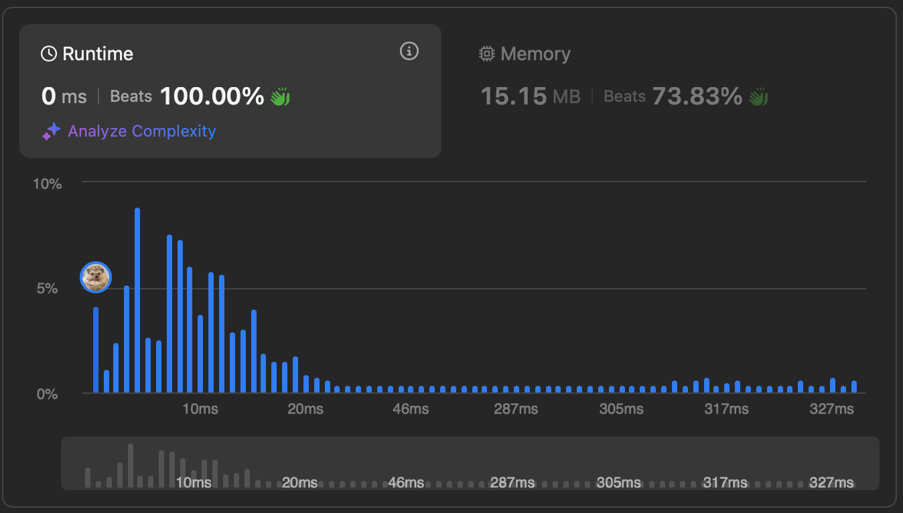

# [155. Min Stack](https://leetcode.com/problems/min-stack/description/)


## Problem Description

Design a stack that supports `push`, `pop`, `top`, and retrieving the minimum element in constant time.

Implement the `MinStack` class:

• `MinStack()` initializes the stack object.
• `void push(int val)` pushes the element val onto the stack.
• `void pop()` removes the element on the top of the stack.
• `int top()` gets the top element of the stack.
• `int getMin()` retrieves the minimum element in the stack.
You must implement a solution with `O(1)` time complexity for each function.

### Example 1:
```plaintext
Input
["MinStack","push","push","push","getMin","pop","top","getMin"]
[[],[-2],[0],[-3],[],[],[],[]]

Output
[null,null,null,null,-3,null,0,-2]

Explanation
MinStack minStack = new MinStack();
minStack.push(-2);
minStack.push(0);
minStack.push(-3);
minStack.getMin(); // return -3
minStack.pop();
minStack.top();    // return 0
minStack.getMin(); // return -2
```

## Solution

```python
# solution.py

class MinStack(object):

    def __init__(self):
        self.stack = []
        self.mins = []

    def push(self, val):
        """
        :type val: int
        :rtype: None
        """
        self.stack.append(val)
        val = min(val, self.mins[-1]) if self.mins else val
        self.mins.append(val)

    def pop(self):
        """
        :rtype: None
        """
        self.stack.pop()
        self.mins.pop()

    def top(self):
        """
        :rtype: int
        """
        return self.stack[-1]

    def getMin(self):
        """
        :rtype: int
        """
        return self.mins[-1]
```

## Explanation
Complexity

Time: O(1) for all functions

Space: O(2n) -> O(n)

We keep track on the minuimum by having another stack of min values.

## Results

The following graphs show the performance of the solution:

### Time Complexity


### Memory Usage
