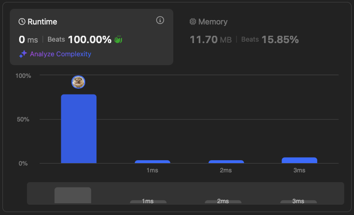

# [199. Binary Tree Right Side View](https://leetcode.com/problems/binary-tree-right-side-view/description/)


## Problem Description

Given the `root` of a binary tree, imagine yourself standing on the right side of it, return the values of the nodes you can see ordered from top to bottom.


### Example 1:
```plaintext
Input: root = [1,2,3,null,5,null,4]
Output: [1,3,4]
```

### Example 2:
```plaintext
Input: root = [1,null,3]
Output: [1,3]
```

### Example 3:
```plaintext
Input: root = []
Output: []
```

### Constraints:
- The number of nodes in the tree is in the range `[0, 100]`.
- `-100 <= Node.val <= 100`
  
## Solution

```python
# solution.py

def rightSideView(self, root):
    """
    :type root: Optional[TreeNode]
    :rtype: List[int]
    """
    queue = collections.deque([root])
    nodes = []

    while queue:
        rightmost = None

        for i in range(len(queue)):
            node = queue.popleft()

            if node:
                rightmost = node.val

                if node.left:
                    queue.append(node.left)
                if node.right:
                    queue.append(node.right)

        if rightmost or rightmost==0:
            nodes.append(rightmost)

    return nodes
```

## Explanation
Complexity

Time: O(n)

Space: O(n)

Since the right side view of a binary tree is a collection of rightmost nodes of each level. So, considering the traversal order of BFS, we can use to find the rightmost node of each level by storing the very last node of each level.

## Results

The following graphs show the performance of the solution:

### Time Complexity


### Memory Usage
