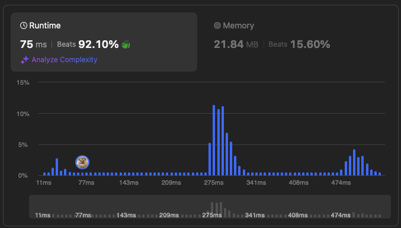
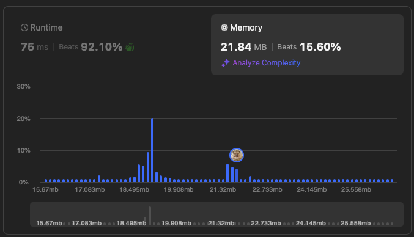
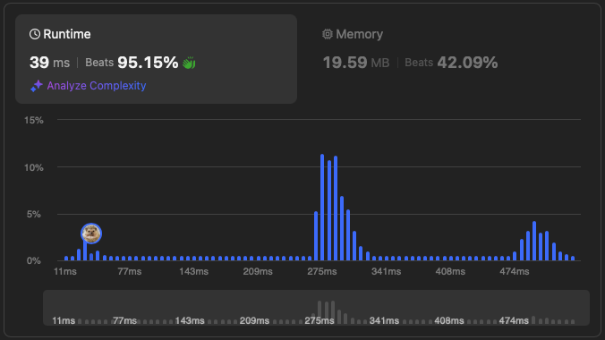
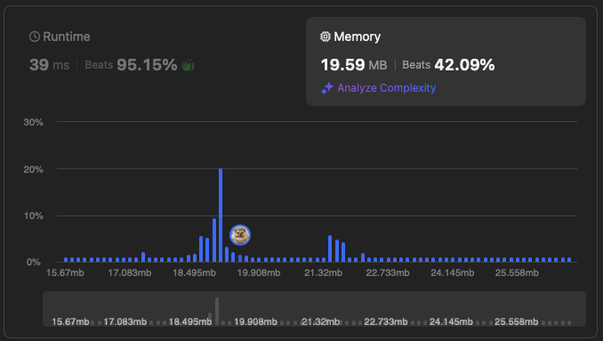

# [238. Product of Array Except Self](https://leetcode.com/problems/product-of-array-except-self/)

## Problem Description

Given an integer array `nums`, return an array output where output[i] is the product of all the elements of `nums` except `nums[i]`.
Each product is guaranteed to fit in a 32-bit integer.
Do not use division.

### Example 1:
```plaintext
Input: nums = [1,2,3,4]
Output: [24,12,8,6]
```

### Example 2:
```plaintext
Input: nums = [-1,1,0,-3,3]
Output: [0,0,9,0,0]
```

### Constraints:
- `2 <= nums.length <= 10^5`
- `-30 <= nums[i] <= 30`
- The product of any prefix or suffix of nums is guaranteed to fit in a 32-bit integer.
  
## Solution

```python
# solution.py

def productExceptSelf1(self, nums): # solution 1
    """
    :type nums: List[int]
    :rtype: List[int]
    """
    
    front, back = [0 for _ in range(len(nums))], [0 for _ in range(len(nums))] # O(n)

    for i in range(len(nums)): # O(n)
        if i == 0:
            front[i], back[-i-1] = nums[i], nums[-i-1]
        else:
            front[i], back[-i-1] = nums[i]*front[i-1], nums[-i-1]*back[-i]

    result = []
    for i in range(len(nums)): # O(n)
        if i == 0:
            result.append(back[i+1])
        elif i == len(nums)-1:
            result.append(front[i-1])
        else:
            result.append(front[i-1]*back[i+1])

    return result
```

```python
# solution.py

def productExceptSelf2(self, nums): # solution 2
    """
    :type nums: List[int]
    :rtype: List[int]
    """
    
    res = [1] * len(nums) # O(n)

    front = 1
    for i in range(len(nums)): # O(n)
        res[i] = front
        front *= nums[i]
    
    back = 1
    for i in range(len(nums)): # O(n)
        res[-i-1] *= back
        back *= nums[-i-1]
    
    return res
```

## Explanation
Complexity

Time: O(n)

Space: O(n)

We store the product of the elements in front of the current element, and product of the elements behind the current element. Then calculate the products of front and back products for each element.

Complexity

Time: O(n)

Space: O(n)

The idea is the same, but we don't store the products, so it's faster and takes less space in practice.

## Results

The following graphs show the performance of the solution:

### Time Complexity 1


### Memory Usage 1


### Time Complexity 2


### Memory Usage 2
