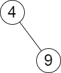

# [2476. Closest Nodes Queries in a Binary Search Tree](https://leetcode.com/problems/closest-nodes-queries-in-a-binary-search-tree/description/)


## Problem Description

You are given the `root` of a binary search tree and an array `queries` of size `n` consisting of positive integers.

Find a 2D array `answer` of size `n` where `answer[i] = [min_i, max_i]`:

- `min_i` is the largest value in the tree that is smaller than or equal to `queries[i]`. If a such value does not exist, add `-1` instead.
- `max_i` is the smallest value in the tree that is greater than or equal to `queries[i]`. If a such value does not exist, add `-1` instead.

Return the array `answer`.


### Example 1:
```plaintext
Input: root = [6,2,13,1,4,9,15,null,null,null,null,null,null,14], queries = [2,5,16]
Output: [[2,2],[4,6],[15,-1]]
```



### Example 2:
```plaintext
Input: root = [4,null,9], queries = [3]
Output: [[-1,4]]
```

### Constraints:
- `The number of nodes in the tree is in the range [2, 10^5]`.
- `1 <= Node.val <= 10^6`
- `n == queries.length`
- `1 <= n <= 10^5`
- `1 <= queries[i] <= 10^6`


## Solution

```python
# solution.py

def closestNodes(self, root, queries):
    """
    :type root: Optional[TreeNode]
    :type queries: List[int]
    :rtype: List[List[int]]
    """
    result = []
    tree = []
    def traverse(node, tree):
        if not node:
            return 
        
        traverse(node.left, tree)
        tree.append(node.val)
        traverse(node.right, tree)

    traverse(root, tree)
    
    for q in queries:
        result.append([-1, -1])
        l, r = 0, len(tree) - 1 
        
        while l <= r:
            mid = l + (r - l)//2

            if tree[mid] == q:
                result[-1] = [q, q]
                break
            elif tree[mid] > q:
                result[-1][1] = tree[mid]
                r = mid - 1
            elif tree[mid] < q:
                result[-1][0] = tree[mid]
                l = mid + 1

    return result
```

## Explanation
Complexity

Time: O(n)

Space: O(n)

We first make a list of nodes by recursively inorder traversing the tree to make it sorted. Then we append a pair for each query. Then we perform a binary search to update the pair, which is the last pair in the list for each iteration. If the mid value is smaller than query then we update the `mini`, if it's larger than query then we update the `maxi`, and if they're equal then we keep the values and break the loop.


## Results

The following graphs show the performance of the solution:

### Time Complexity


### Memory Usage
