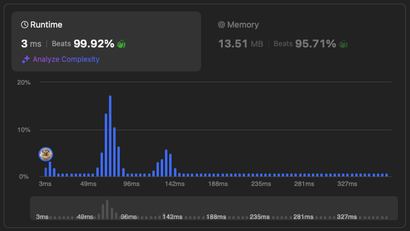
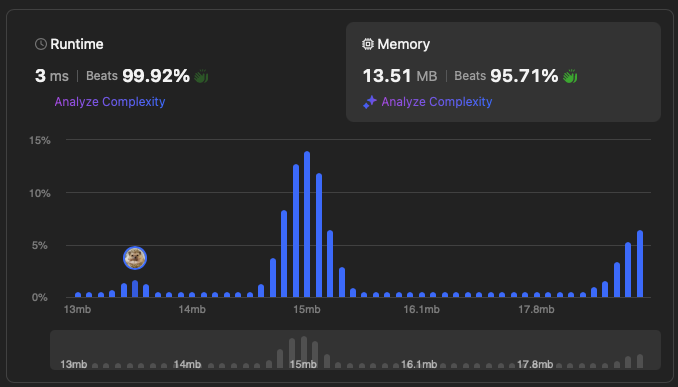
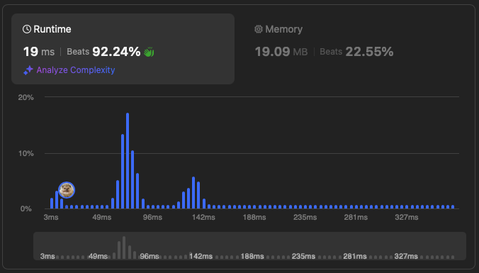
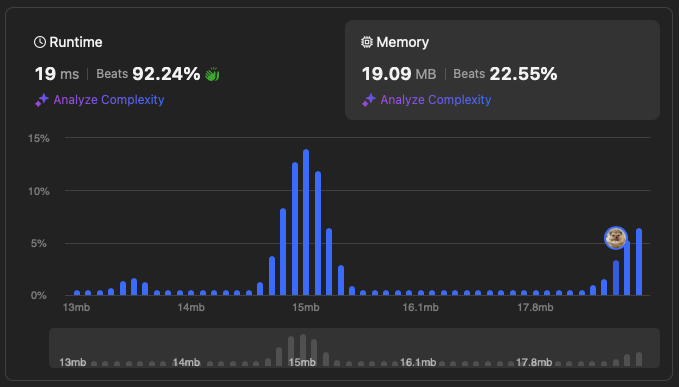

# [49. Group Anagrams](https://leetcode.com/problems/group-anagrams/description/)


## Problem Description

Given an array of strings `strs`, group the anagrams together. You can return the answer in any order.

### Example 1:
```plaintext
Input: strs = ["eat","tea","tan","ate","nat","bat"]
Output: [["bat"],["nat","tan"],["ate","eat","tea"]]
```

### Example 2:
```plaintext
Input: strs = [""]
Output: [[""]]
```

### Example 3:
```plaintext
Input: strs = ["a"]
Output: [["a"]]
```


### Constraints:
- `1 <= strs.length <= 10^4`
- `0 <= strs[i].length <= 100`
- `strs[i]` consists of lowercase English letters.

## Solution

```python
# solution.py

def topKFrequent1(self, nums, k): # solution 1
    """
    :type nums: List[int]
    :type k: int
    :rtype: List[int]
    """
    seen = {}

    for n in nums: # O(n)
        if n in seen:
            seen[n] += 1
        else:
            seen[n] = 1
    
    
    k_ranked = sorted(seen.items(), key = lambda x: x[1], reverse=True)[:k] # O(nlogn)
    return [tup[0] for tup in k_ranked] # O(1)
```

```python
# solution.py

def topKFrequent2(self, nums, k): # solution 2
    """
    :type nums: List[int]
    :type k: int
    :rtype: List[int]
    """
    seen = {}

    for n in nums: # O(n)
        if n in seen:
            seen[n] += 1
        else:
            seen[n] = 1
    
    buckets = [[] for _ in range(len(nums) + 1)] # O(n)

    for n, f in seen.items(): # O(n)
        buckets[f].append(n)

    result = []
    i = -1
    while len(result) != k: # O(n)
        for n in buckets[i]:
            result.append(n)
        i -= 1

    return result
```

## Explanation
Complexity

Time: O(nlogn)

Space: O(n)

First, we make a hashmap of seen elements and frequencies. Then we sort the hashmap by the value (frequency). Lastly, we loop through the sorted list of elements so pick top-k elements.

Complexity

Time: O(n)

Space: O(n)

We start with the same hashmap approach as the above. Then, we will loop through the dictionary to cluster the elements with the same frequnecies into a bucket. Lastly, loop through to pick top-k elements.

## Results

The following graphs show the performance of the solution:

### Time Complexity 1


### Memory Usage 1


### Time Complexity 2


### Memory Usage 2
