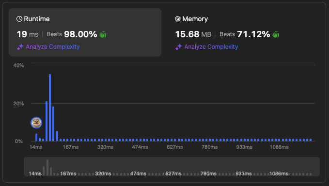
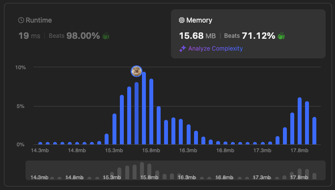
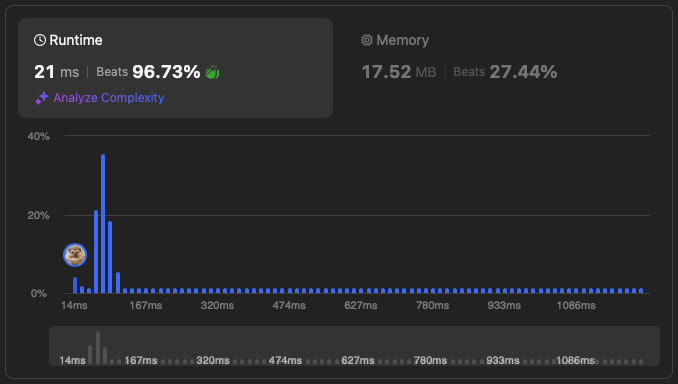
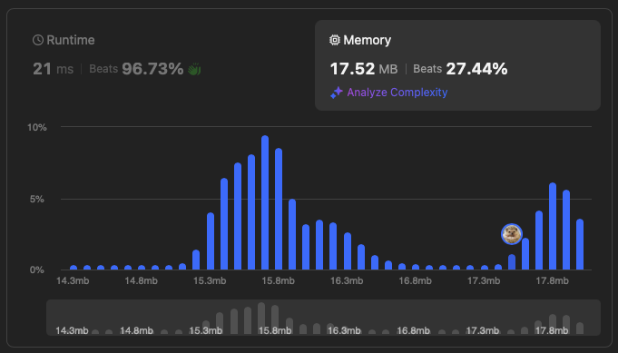

# [49. Group Anagrams](https://leetcode.com/problems/group-anagrams/description/)


## Problem Description

Given an array of strings `strs`, group the anagrams together. You can return the answer in any order.

### Example 1:
```plaintext
Input: strs = ["eat","tea","tan","ate","nat","bat"]
Output: [["bat"],["nat","tan"],["ate","eat","tea"]]
```

### Example 2:
```plaintext
Input: strs = [""]
Output: [[""]]
```

### Example 3:
```plaintext
Input: strs = ["a"]
Output: [["a"]]
```


### Constraints:
- `1 <= strs.length <= 10^4`
- `0 <= strs[i].length <= 100`
- `strs[i]` consists of lowercase English letters.

## Solution

```python
# solution.py

def groupAnagrams1(self, strs): # solution 1
    """
    :type strs: List[str]
    :rtype: List[List[str]]
    """
    seen = dict()

    # O(n), where n is the length of the list
    for word in strs:
        # O(slogs) since join functionn is O(n) and the complexity is dominated by sorting
        # s is the length of the word
        w = ''.join(sorted(word))

        if w in seen:
            seen[w].append(word)
        else:
            seen[w] = [word]            
    
    return list(seen.values())
```

```python
# solution.py

def groupAnagrams2(self, strs): # solution 2
    """
    :type strs: List[str]
    :rtype: List[List[str]]
    """
    seen = {}

    for word in strs: # O(n)
        key = [0]*26 # O(1)

        for c in word: # O(s)
            key[ord(c) - ord('a')] += 1

        key = tuple(key) # O(1)

        if key in seen:
            seen[key].append(word)
        else:
            seen[key] = [word]

    return list(seen.values())
```

## Explanation
Complexity

Time: O(n*slogs)

Space: O(n)

By sorting each word, we can make it as a unique key string for the dictionary to store and categorize the same anagrams together.

Complexity

Time: O(n*s)

Space: O(n)

For each word, we make its list embedding by subtracting the unicode of 'a' from each character of the word to make it into an integer value within 0-25 for an index of the embedding. Then add the count on to the embedding. So each embedding is going to be 26x1 list with values representing how many the corresponding alphabet showed up in the word. The anagrams will have the same embedding so we can cluster them together.

## Results

The following graphs show the performance of the solution:

### Time Complexity 1


### Memory Usage 1


### Time Complexity 2


### Memory Usage 2
