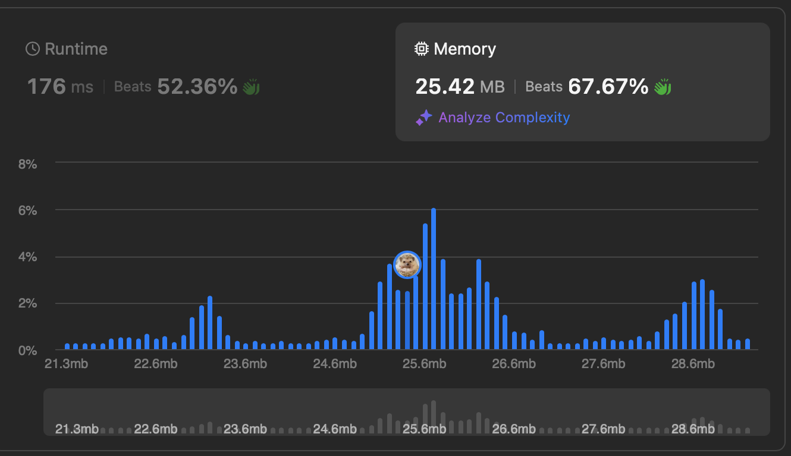

# [739. Daily Temperatures](https://leetcode.com/problems/daily-temperatures/description/)


## Problem Description

Given an array of integers `temperatures` represents the daily temperatures, return an array `answer` such that answer`[i]` is the number of days you have to wait after the `i-th` day to get a warmer temperature. If there is no future day for which this is possible, keep answer`[i] == 0` instead.

### Example 1:
```plaintext
Input: temperatures = [73,74,75,71,69,72,76,73]
Output: [1,1,4,2,1,1,0,0]
```

### Example 2:
```plaintext
Input: temperatures = [30,40,50,60]
Output: [1,1,1,0]
```

### Example 3:
```plaintext
Input: temperatures = [30,60,90]
Output: [1,1,0]
```


### Constraints:
- `1 <= temperatures.length <= 10^5`
- `30 <= temperatures[i] <= 100`

## Solution

```python
# solution.py

def dailyTemperatures(self, temperatures):
    """
    :type temperatures: List[int]
    :rtype: List[int]
    """
    ln = len(temperatures)
    result = [0]*ln
    stack = []

    for i, t in enumerate(temperatures):
        while stack and stack[-1][0] < t:
            temp, j = stack.pop()
            result[j] = i - j
        stack.append((t, i))

    return result
```

## Explanation
Complexity

Time: O(n)

Space: O(n)

Since we have to keep track on last day that was lower than current day's temperature, we use stack to keep the `(temperature, index)` pairs. If the current temperature is higher than the last day's, which is the top of the stack, we pop the pair and update the corresponding element with the difference between current day and the last day of lower days.

## Results

The following graphs show the performance of the solution:

### Time Complexity


### Memory Usage
